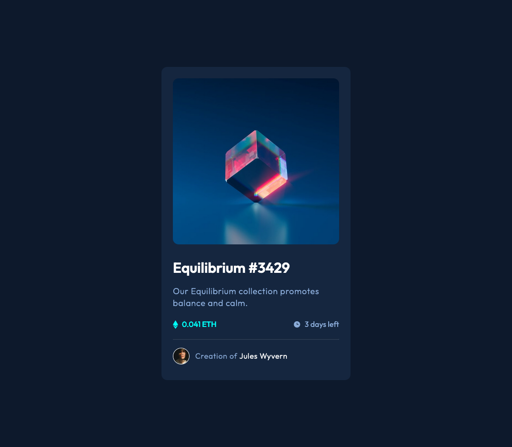

# Frontend Mentor - NFT preview card component solution

This is a solution to the [NFT preview card component challenge on Frontend Mentor](https://www.frontendmentor.io/challenges/nft-preview-card-component-SbdUL_w0U). Frontend Mentor challenges help you improve your coding skills by building realistic projects. 

## Table of contents

- [Frontend Mentor - NFT preview card component solution](#frontend-mentor---nft-preview-card-component-solution)
  - [Table of contents](#table-of-contents)
  - [Overview](#overview)
    - [The challenge](#the-challenge)
    - [Screenshot](#screenshot)
    - [Links](#links)
  - [My process](#my-process)
    - [Built with](#built-with)
  - [Author](#author)

## Overview

### The challenge

Users should be able to:

- View the optimal layout depending on their device's screen size
- See hover states for interactive elements
  
### Screenshot

### Links

- Solution URL: https://www.frontendmentor.io/solutions/nft-preview-card-component-4lDFRU7LAY
- Live Site URL: https://nft-preview-card-component-kappa-ten.vercel.app/

## My process

### Built with

- Vite
- Flexbox
- [React](https://reactjs.org/) - JS library
- [Emotion Styled Components](https://emotion.sh/docs/styled) - For styles

## Author

- Frontend Mentor - [@andrew2764](https://www.frontendmentor.io/profile/andrew2764)
